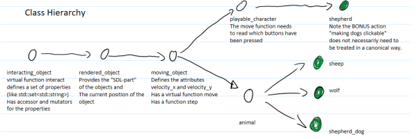

# E4_INF_4102A

## Avancement
### Fait
- Affichage d'une fenêtre
- Affichage d'un fond 
- Affichage des animaux
- Fermeture de la fenêtre
- Si loup ne mange pas un moutons dans le temps impartis, il meurt
- Si loup "touche" un mouton : le mouton meurt
- Les animaux morts sont retirés du vector
### A faire
- Ajouter un personnage controllable (avec les touches Q,Z,S et D ou avec les flèches directionnel)
- Lorsque 2 moutons se rencontre ils peuvent se reproduire et avoir un enfant si:
    - ils sont de sexe opposé
    - la femelle n'a pas enfanté depuis un certain temps
- Si les moutons s'approchent de trop près des loups, ils vont dans la direction opposé et vont plus vite
- Ajouter les chiens qui tourne autour du berger
- Loup traquent les moutons le plus proche d'eux

- Chiens traques + tue les loup

- BONUS: ajouter un compteur de score
- BONUS: Faire grandir le bébé mouton
- BONUS: Chiens clickable

## Hiérarchie du code
Principe des classe [fermé/Ouverts](https://fr.wikipedia.org/wiki/Principe_ouvert/ferm%C3%A9)

____ 

## Execution
### Via le terminal
`<Path_to_the_executable> <number_of_sheep> <number_of_wolf> <display_time>`
### Via Clion
- Importer le projet dans clion
- Run>Edit configurations> Program arguments
- ` <number_of_sheep> <number_of_wolf> <display_time>`
